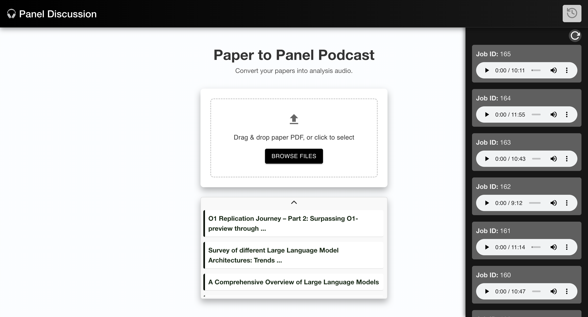

# InsightPodcast - Automated Paper to Podcast Generator 多专家论文讨论

[功能更新 13/Feb/2025] 上传时滚动推荐相关论文链接。

A system that converts academic papers into podcast-style audio files using text-to-speech technology.



[Watch the demo video](https://youtu.be/uVNO6MFsjRU)


---

## 🛠️ Setup & Run Guide

### **Prerequisites**
- Node.js v18+
- npm v9+
- FFmpeg (for audio processing)
- Redis (for task queue, optional)

---

## **Backend Setup (Express.js)**

### 1. Clone Repository
```bash
git clone https://github.com/ZhentaoFan/InsightPodcast.git
cd InsightPodcast/backend
```

### 2. Install Dependencies
```
npm install
```

### 3. Ask Zhentao For .env & apikey

### 4. Create Storage Directories

```
mkdir -p storage/uploads storage/audio
```

### 5. Start Server

```
npm run dev
```

Server runs at http://localhost:3000


---

## **Frontend Setup (React + Vite)**

### 1. Navigate to Frontend
```bash
cd ../frontend
```

### 2. Install Dependencies
```bash
npm install
```

### 3. Configure API Endpoint
Edit `vite.config.js`:
```javascript
server: {
  proxy: {
    '/api': 'http://localhost:3000' // Match backend port
  }
}
```

### 4. Start Development Server
```bash
npm run dev
```
Access at `http://localhost:5173`

---

## 🚀 Full System Run
1. **Start Services in Order**:
   ```bash
   # Terminal 1 - Backend
   cd backend && npm run dev
   
   # Terminal 2 - Frontend 
   cd frontend && npm run dev
   ```

2. **Test Workflow**:
   - Open browser to `http://localhost:5173`
   - Upload PDF file
   - Wait for processing
   - Play generated audio
